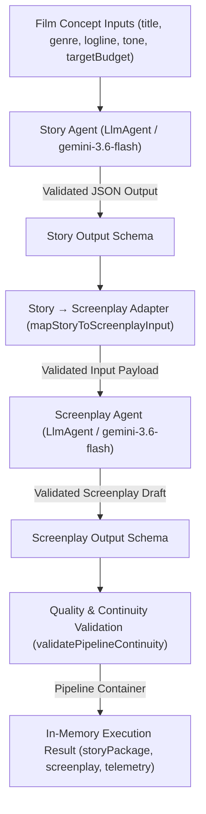

# Phase 3C — Real Story Agent → Screenplay Agent Pipeline Documentation

## Overview & Objectives

**Phase 3C** establishes the first genuine **Multi-Agent Production Pipeline** in CineAgent Studio. It connects the live **Story Agent** to the live **Screenplay Agent**, replacing artificial test fixtures with real Story Agent output generated via Google ADK (`@google/adk`) and Google Gemini (`gemini-3.6-flash`).

This implementation introduces:
1. **Story → Screenplay Adapter** (`mapStoryToScreenplayInput`)
2. **Automated Story-to-Screenplay Continuity Validator** (`validatePipelineContinuity`)
3. **End-to-End Pipeline Orchestrator** (`runStoryToScreenplayPipeline`)
4. **Pipeline Error & Failure Boundary Handling**
5. **10 New Unit Tests + 1 Real Multi-Agent Live Integration Test**

---

## Pipeline Architecture & Workflow

---

## Input / Output Mapping & Adapter Contract

The adapter function `mapStoryToScreenplayInput(storyPackage, conceptInputs)` receives the raw structured output from `runStoryAgent` alongside initial concept parameters and maps them to the `ScreenplayInputSchema` contract:

| Story Agent Output Field | Concept Input Field | Screenplay Agent Input Target | Validation Constraint |
|---|---|---|---|
| — | `conceptInputs.title` | `title` | Non-empty string |
| `storyPackage.telemetry.projectId` | `conceptInputs.projectId` | `projectId` | Lowercase sanitized identifier |
| `storyPackage.logline` | — | `logline` | Non-empty string |
| — | `conceptInputs.genre` | `genre` | String (`N/A` fallback) |
| — | `conceptInputs.tone` | `tone` | String (`N/A` fallback) |
| `storyPackage.synopsis` | — | `synopsis` | Non-empty string |
| `storyPackage.three_act_structure` | — | `three_act_structure` | Act 1, Act 2, Act 3 strings |
| `storyPackage.characters` | — | `characters` | Non-empty array of character objects |

---

## Continuity Checks (`validatePipelineContinuity`)

Before returning the final pipeline container, automated deterministic checks enforce story-to-screenplay narrative continuity:
1. **Title Matching**: Screenplay `title` must match concept/story `title` (case-insensitive).
2. **Character Presence**: At least one character defined in `storyPackage.characters` must appear in the dialogue or action blocks of the generated screenplay scenes.
3. **Scene Count**: Screenplay must contain between 2 and 3 scenes (`.min(2).max(3)`).
4. **Scene Numbering**: Sequential 1-based scene numbering (`1, 2, 3`).

---

## Failure Handling

- **Story Agent Failure**: If the Story Agent fails or yields invalid output, the pipeline throws an explicit error immediately. The Screenplay Agent is **NOT** invoked.
- **Screenplay Agent Failure**: If the Screenplay Agent fails or yields invalid output, the pipeline fails and throws a validation error.
- **No Mock Fallbacks**: The pipeline never silently injects fake/mock replacement screenplays on failure.

---

## Files Created / Modified

| Action | File Path | Purpose |
|---|---|---|
| **CREATED** | `server/agents/pipeline.js` | Adapter logic (`mapStoryToScreenplayInput`), continuity validator (`validatePipelineContinuity`), and multi-agent pipeline runner (`runStoryToScreenplayPipeline`). |
| **CREATED** | `docs/PHASE3C_AGENT_PIPELINE.md` | Comprehensive Phase 3C pipeline documentation and architectural diagram. |
| **MODIFIED** | `tests/unit.test.js` | Added 10 Phase 3C adapter unit tests covering mapping, missing title, missing characters, missing logline, invalid story structure, character/title preservation, and continuity checks. |
| **MODIFIED** | `tests/integration.test.js` | Added Phase 3C end-to-end multi-agent integration test executing live Story Agent -> Adapter -> Screenplay Agent -> Validation. |

---

## Test Verification Summary

### Unit Tests (`tests/unit.test.js`) — 33 Total Unit Tests
* 3 Base environment & configuration unit tests (`PASS`)
* 17 Phase 3B Screenplay format & quality unit tests (`PASS`)
* 10 Phase 3C Story to Screenplay Adapter unit tests (`PASS`)

### Integration Tests (`tests/integration.test.js`) — 4 Live Integration Tests
1. Live Story Agent execution against Gemini API (`PASS`)
2. Live ClickHouse MCP runtime path (`initMcpClient`, `run_query`, DDL, writes, reads, ADK tool) (`PASS`)
3. Live Screenplay Agent fixture integration test (`PASS`)
4. Live End-to-End Story Agent → Screenplay Agent Pipeline integration test (`PASS`)

---

## Strict Scope Boundary & Known Limitations

* **Implemented in Phase 3C**: Multi-agent orchestration between Story Agent and Screenplay Agent, adapter mapping, continuity validation, and live end-to-end integration testing.
* **Deferred Sub-phases (NOT implemented in Phase 3C)**:
  * Phase 3D: ClickHouse Screenplay telemetry logging.
  * Phase 3E: React UI screenplay view components.
  * Phase 3F: Full end-to-end multi-agent system verification.

---

**Status**: `PHASE 3C COMPLETE`
