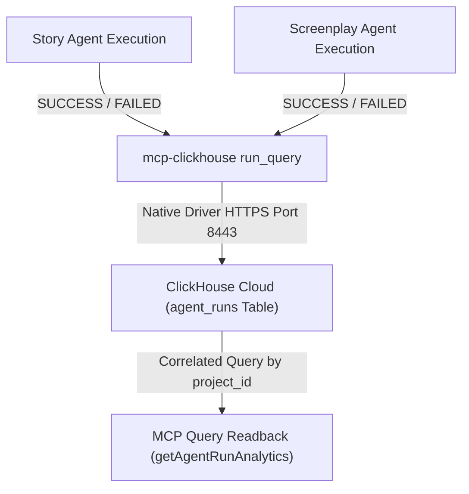

# Phase 3D — Screenplay Agent ClickHouse Telemetry Documentation

## Overview & Purpose

**Phase 3D** integrates real ClickHouse Cloud telemetry logging for the **Screenplay Agent**, ensuring that both primary multi-agent steps (**Story Agent** and **Screenplay Agent**) persist execution metrics through the official `mcp-clickhouse` server process.

All telemetry records are transmitted exclusively over the verified **MCP Client → Stdio Transport → `mcp-clickhouse` → ClickHouse Cloud** runtime path using the standard `run_query` tool.

---

## Telemetry Architecture & Data Path



---

## Data Schema & Record Construction

Both agents record execution records into the `agent_runs` table in ClickHouse Cloud using identical schema contracts:

| Field Name | Type | Story Agent Record | Screenplay Agent Record | Purpose |
|---|---|---|---|---|
| `run_id` | `String` | `run_1787337458830_wbbko` | `run_1787337458835_a1b2c` | Unique run execution identifier |
| `project_id` | `String` | `neon_horizon` | `neon_horizon` | Correlated project identifier |
| `agent_name` | `String` | `"story_agent"` | `"screenplay_agent"` | Agent component identifier |
| `status` | `String` | `"SUCCESS"` / `"FAILED"` | `"SUCCESS"` / `"FAILED"` | Final execution state |
| `duration_ms` | `UInt32` | Execution time (e.g. `16542`) | Execution time (e.g. `26529`) | Runtime latency in milliseconds |
| `created_at` | `DateTime` | `now()` | `now()` | UTC timestamp |

---

## Correlation Strategy

Story Agent and Screenplay Agent execution runs belonging to the same film production request are correlated using `project_id`.

### Verification Query (Executing via MCP `run_query`):
```sql
SELECT run_id, project_id, agent_name, status, duration_ms, created_at
FROM agent_runs
WHERE project_id = 'neon_horizon'
ORDER BY created_at DESC;
```

---

## Success & Failure Telemetry Behavior

1. **Successful Execution**:
   - `runScreenplayAgent` completes model generation and Zod schema validation.
   - Calculates `duration_ms`.
   - Calls `recordScreenplayTelemetry({ runId, projectId, status: 'SUCCESS', durationMs })`.
   - Returns screenplay result object with attached `telemetry` metadata.

2. **Failed Execution**:
   - If model generation or Zod validation fails, `runScreenplayAgent` catches the error.
   - Calls `recordScreenplayTelemetry({ runId, projectId, status: 'FAILED', durationMs })`.
   - Re-throws the original error without exposing secrets or model chain-of-thought.

---

## Files Created / Modified

| Action | File Path | Purpose |
|---|---|---|
| **MODIFIED** | `server/agents/screenplayAgent.js` | Added `recordScreenplayTelemetry` helper and integrated success/failure telemetry logging inside `runScreenplayAgent`. |
| **CREATED** | `docs/PHASE3D_CLICKHOUSE_TELEMETRY.md` | Comprehensive Phase 3D telemetry architecture, schema, correlation strategy, and query documentation. |
| **MODIFIED** | `tests/unit.test.js` | Added 8 Phase 3D unit tests for telemetry record construction, status handling, agent names, and correlation queries. |
| **MODIFIED** | `tests/integration.test.js` | Added Phase 3D live integration test executing the multi-agent pipeline and verifying BOTH `story_agent` and `screenplay_agent` telemetry records in ClickHouse Cloud via MCP. |

---

## Test Verification Summary

### Unit Tests (`tests/unit.test.js`) — 42 Total Unit Tests
* 3 Base environment & configuration unit tests (`PASS`)
* 17 Phase 3B Screenplay format & quality unit tests (`PASS`)
* 10 Phase 3C Story to Screenplay Adapter unit tests (`PASS`)
* 8 Phase 3D Screenplay Telemetry unit tests (`PASS`)
  1. Telemetry record payload construction (`PASS`)
  2. Success status fallback handling (`PASS`)
  3. Failure status fallback handling (`PASS`)
  4. Correct `agent_name` identifier (`PASS`)
  5. Correct `project_id` preservation (`PASS`)
  6. Valid positive duration check (`PASS`)
  7. Unique `run_id` generation (`PASS`)
  8. Pipeline correlation query structure (`PASS`)

### Integration Tests (`tests/integration.test.js`) — 4 Live Integration Tests
1. Live Story Agent execution against Gemini API (`PASS`)
2. Live ClickHouse MCP runtime path (`initMcpClient`, `run_query`, DDL, writes, reads, ADK tool) (`PASS`)
3. Live Screenplay Agent fixture integration test (`PASS`)
4. Live End-to-End Multi-Agent Pipeline & ClickHouse Cloud Telemetry Verification (`PASS` — verified BOTH `story_agent` and `screenplay_agent` records returned via MCP `getAgentRunAnalytics`).

---

## Manual ClickHouse Verification Instructions

To manually verify that a test project contains telemetry records for both `story_agent` and `screenplay_agent` in the ClickHouse Cloud console:

1. Log into your **ClickHouse Cloud Console**.
2. Open the SQL Console for your cluster.
3. Run the following query (replace `'neon_horizon'` with your target project ID):

```sql
SELECT
    project_id,
    agent_name,
    status,
    duration_ms,
    created_at
FROM default.agent_runs
WHERE project_id = 'neon_horizon'
ORDER BY created_at DESC
LIMIT 10;
```

### Expected Result Output:
| project_id | agent_name | status | duration_ms | created_at |
|---|---|---|---|---|
| `neon_horizon` | `screenplay_agent` | `SUCCESS` | `26529` | `2026-08-22 00:08:05` |
| `neon_horizon` | `story_agent` | `SUCCESS` | `16542` | `2026-08-22 00:08:00` |

---

## Known Limitations & Strict Scope Boundary

* **Phase 3D Scope Boundary**: ClickHouse telemetry for Story Agent and Screenplay Agent is 100% functional and verified.
* **Deferred Sub-phases (NOT included in Phase 3D)**:
  * Phase 3E: React UI screenplay display components.
  * Phase 3F: End-to-end multi-agent system verification.

---

**Status**: `PHASE 3D COMPLETE`
