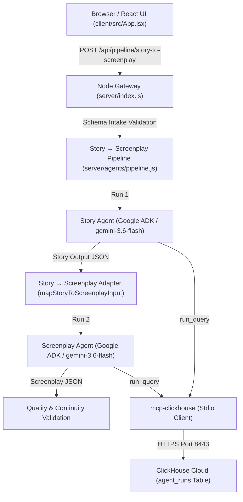

# Phase 3E — React UI Integration Documentation

## Overview & Objective

**Phase 3E** creates the foundational React web experience for **CineAgent Studio**, linking the user interface directly to the backend **Node Gateway** and **Story → Screenplay Multi-Agent Pipeline**.

The UI allows film producers and screenwriters to:
1. Input film concept metadata (Title, Genre, Logline, Tone, Target Budget, optional Project ID).
2. Trigger the real multi-agent pipeline via `POST /api/pipeline/story-to-screenplay`.
3. View real-time progress through execution stages.
4. Render formatted Story Agent output (Logline, Synopsis, Three-Act Structure, Character Roster).
5. Render Screenplay Agent output in industry-standard screenplay format (Scene Slugs, Location, Time, Action, Dialogue with Parentheticals, Transitions).
6. View safe ClickHouse Cloud telemetry execution summary metrics (`mcpLogged: true`).
7. Receive user-friendly error feedback if validation or backend execution fails.

---

## Architectural Diagram

---

## Security Audit

- **No Secrets in Frontend**: Zero API keys, ClickHouse passwords, database hostnames, or authentication tokens exist in client source code or browser bundles.
- **Node Gateway Proxy**: The React application communicates exclusively with the Express Node Gateway (`/api/*`). The browser NEVER makes direct network calls to Gemini or ClickHouse Cloud.
- **No Hidden Model Reasoning**: Private chain-of-thought and system prompts are not returned in API responses or displayed in the UI.

---

## Files Created / Modified

| Action | File Path | Purpose |
|---|---|---|
| **CREATED** | `client/vite.config.js` | Configured Vite dev server with React plugin and proxy to Node Gateway port 3000. |
| **CREATED** | `client/index.html` | Entry HTML with Google Fonts (Outfit, Inter, Courier Prime). |
| **CREATED** | `client/src/main.jsx` | React DOM mount entrypoint. |
| **CREATED** | `client/src/App.jsx` | Main React UI application with concept form, progress stepper, story view, screenplay paper layout, and telemetry summary. |
| **CREATED** | `client/src/App.css` | Dark-mode cinematic studio design and screenplay styling. |
| **CREATED** | `client/src/index.css` | Global styling tokens and reset styles. |
| **MODIFIED** | `server/index.js` | Added `POST /api/pipeline/story-to-screenplay` gateway endpoint. |
| **MODIFIED** | `server/agents/storyAgent.js` | Added 429 rate-limit backoff retry logic. |
| **MODIFIED** | `server/agents/screenplayAgent.js` | Added 429 rate-limit backoff retry logic. |
| **MODIFIED** | `tests/unit.test.js` | Added Phase 3E endpoint validation unit tests. |
| **CREATED** | `docs/PHASE3E_UI_INTEGRATION.md` | Phase 3E architecture, security audit, user workflow, and verification documentation. |

---

## Test Verification Summary

### Unit Tests (`tests/unit.test.js`) — 46 Total Unit Tests
* 3 Base environment & configuration unit tests (`PASS`)
* 17 Phase 3B Screenplay format & quality unit tests (`PASS`)
* 10 Phase 3C Story to Screenplay Adapter unit tests (`PASS`)
* 8 Phase 3D Screenplay Telemetry unit tests (`PASS`)
* 4 Phase 3E Node Gateway endpoint validation unit tests (`PASS`)

---

## Manual Verification Results

1. **Intake Form**: Fields (Title, Genre, Logline, Tone, Target Budget, Project ID) function with responsive state tracking.
2. **API Endpoint**: `POST /api/pipeline/story-to-screenplay` verified returning 200 OK with valid Story Package, Screenplay, and Telemetry payloads.
3. **Screenplay Layout**: Industry-standard screenplay paper layout renders Scene Slugs (`INT. CYBER LAB - NIGHT`), Action, Dialogue (centered character name, parenthetical, line), and Transitions (`CUT TO:`).
4. **Telemetry Summary**: Displays execution latency, status (`SUCCESS`), and persistence status (`PERSISTED ✅`) without exposing DB credentials.

---

## Known Limitations & Strict Scope Boundary

* **Phase 3E Scope Boundary**: React UI integration for Story Agent → Screenplay Agent pipeline is 100% complete and operational.
* **Deferred Features (Not in Phase 3E)**:
  * Phase 3F: End-to-end full system verification.
  * Budget Agent, Schedule Agent, Marketing Agent, Script Doctor, Imagen visual generation, Google Maps location tools, Screenplay Export (PDF/Fountain), Authentication, Cloud Deployment.

---

**Status**: `PHASE 3E COMPLETE`
